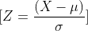
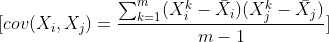
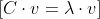
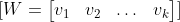
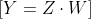

# Principal Component Analysis (PCA) Steps

## Step 1: Standardize the Data

Given a dataset with m observations and n features, the first step is to standardize the data by subtracting the mean (μ) of each feature and dividing by its standard deviation (σ):

## Step 2: Compute the Covariance Matrix

Next, compute the covariance matrix (C) for the standardized data. The covariance between two features i and j is given by:

The covariance matrix (C) is an n*n matrix where each element Cij is the covariance between features i and j.

## Step 3: Compute Eigenvectors and Eigenvalues

Find the eigenvectors (v) and eigenvalues (λ) of the covariance matrix:

## Step 4: Sort Eigenvectors by Eigenvalues

Sort the eigenvectors in descending order based on their corresponding eigenvalues. This step is crucial as it determines the order of importance of the principal components.

## Step 5: Select Principal Components

Choose the top k eigenvectors to form the transformation matrix W, where k is the desired number of dimensions in the reduced space.

## Step 6: Transform the Data

Multiply the standardized data (Z) by the transformation matrix (W) to obtain the new set of features (Y) in the reduced dimensional space.

## Final Note

The resulting Y matrix represents the data in a new coordinate system, and the columns of W are the principal components. This transformation retains as much variance as possible while reducing the dimensionality of the data.
